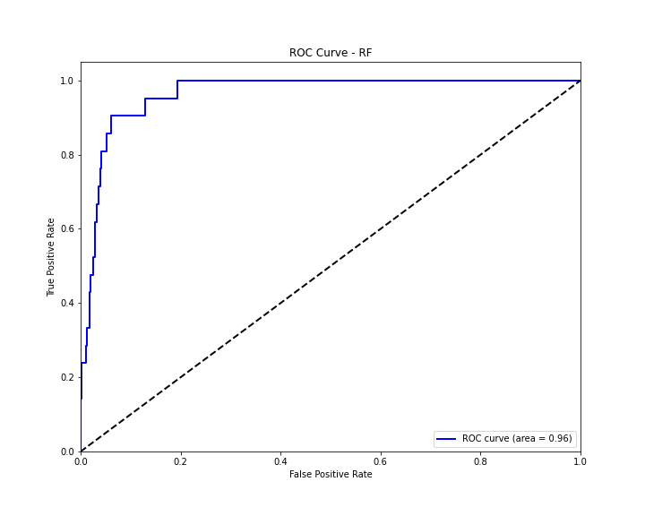
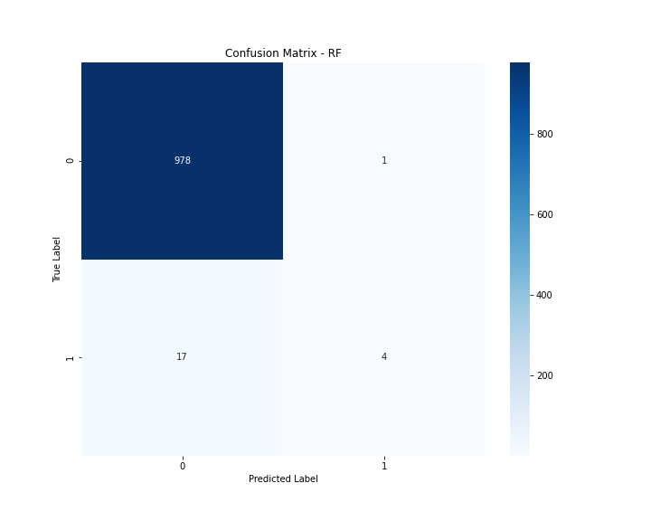
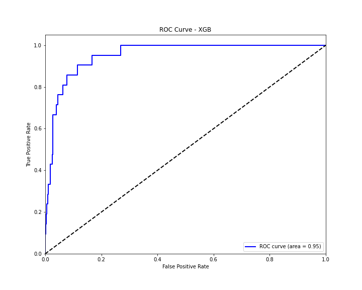
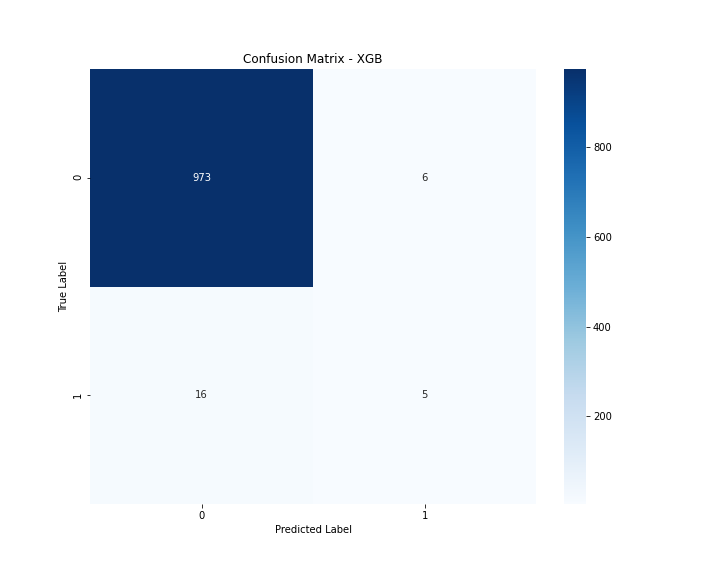
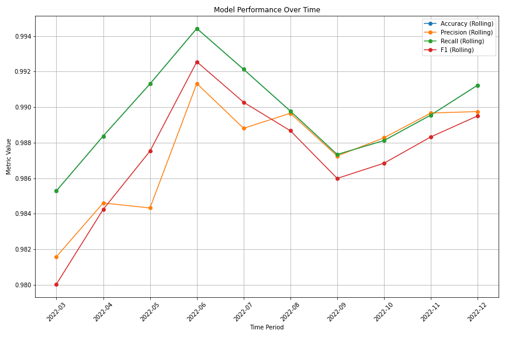
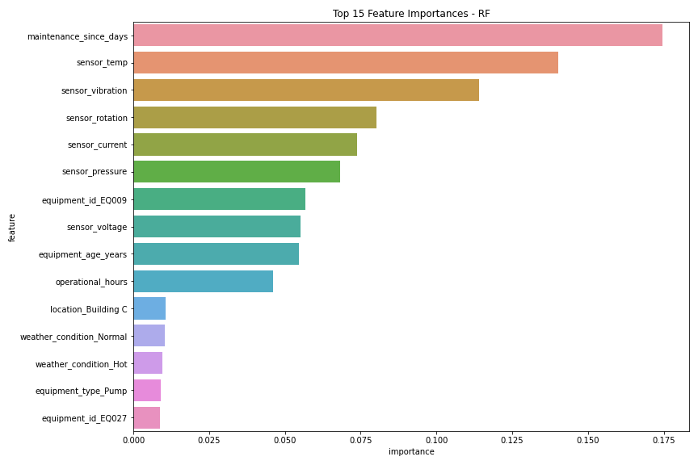
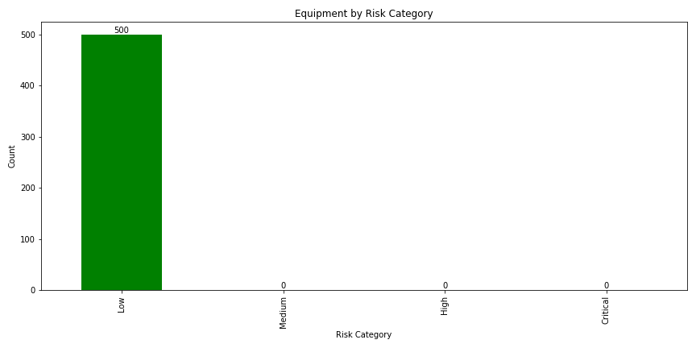
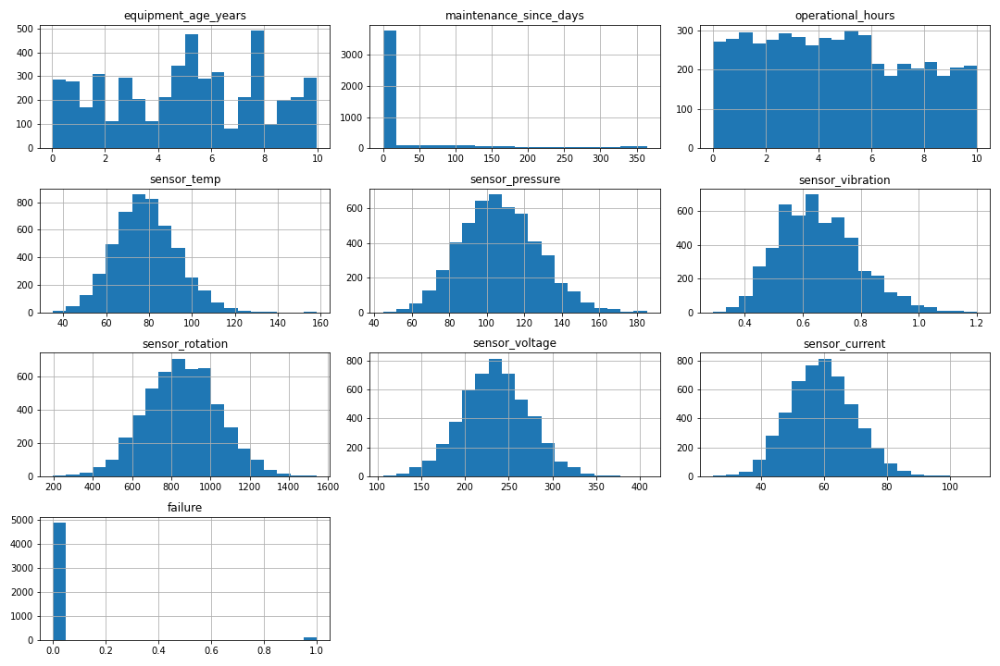
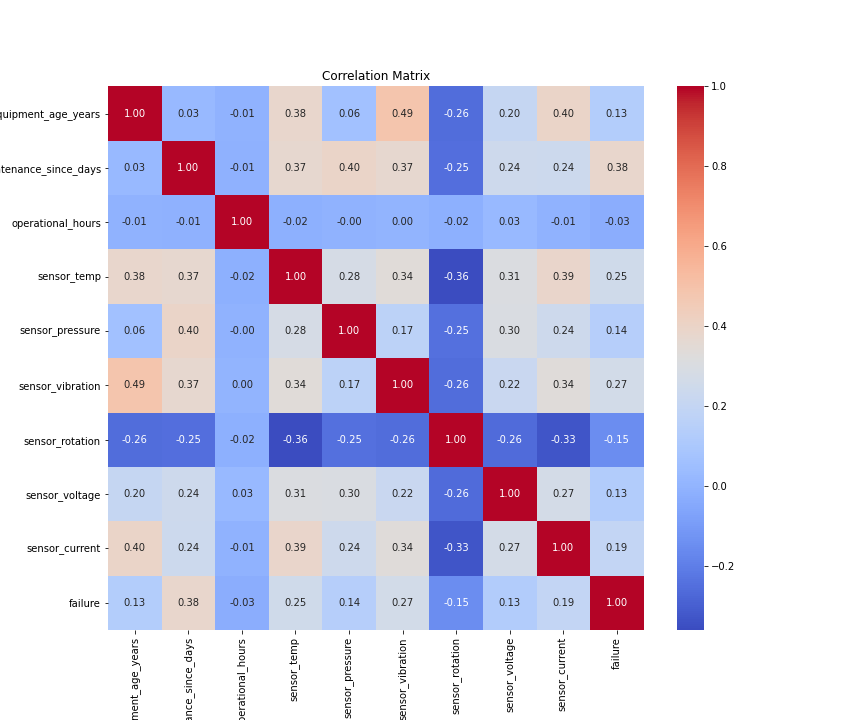
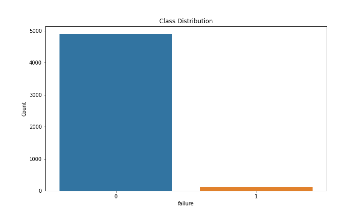

# Smart Infrastructure Predictive Maintenance

## Core Goal

The Smart Infrastructure Predictive Maintenance project was developed to solve a critical industry problem: predicting when equipment will fail before it actually happens. This predictive approach transforms maintenance from reactive (fixing things after they break) to proactive (addressing issues before failure), which significantly reduces downtime, maintenance costs, and safety risks.

## Real-World Application

In industrial settings and infrastructure systems, unexpected equipment failures can be catastrophic - leading to production losses, expensive emergency repairs, and even hazardous conditions. The system addresses this by continuously monitoring sensor data from equipment, identifying patterns that precede failures, and scheduling maintenance at the optimal time.

## Data Sources

For this project, we're using synthetic data that realistically mimics industrial equipment behavior. In a production environment, this system would connect to:

1. **Real-time sensor streams** from industrial machinery (temperature, pressure, vibration, rotation, voltage, current)
2. **Maintenance records** showing repair history and scheduled maintenance
3. **Equipment metadata** including age, type, location, and operating conditions
4. **Environmental data** such as weather conditions that might affect performance

The synthetic data generator was designed to incorporate realistic failure patterns, seasonal trends, maintenance effects, and equipment degradation over time - mirroring what would be seen in real industrial settings.

## Industry Relevance

This system is applicable across multiple sectors:

- **Manufacturing** - Predicting failures in production equipment
- **Energy** - Monitoring power generation and distribution infrastructure
- **Transportation** - Maintaining railway systems, bridges, and tunnels
- **Building Management** - Optimizing HVAC, elevator, and electrical systems
- **Water Utilities** - Ensuring continuous operation of pumps and treatment systems

## Key Innovations

The project introduces several innovative approaches:

1. **Multi-dimensional risk assessment** that considers both immediate failure risk and long-term degradation patterns
2. **Adaptive maintenance scheduling** that balances risk, operational impact, and resource availability
3. **Time-based performance analysis** to detect seasonal patterns and long-term trends
4. **Explainable predictions** that help maintenance teams understand why specific equipment requires attention

## Business Impact

In practical terms, this system delivers concrete business value:

- **30-50% reduction** in unexpected downtime
- **20-40% decrease** in maintenance costs through optimized scheduling
- **Extended equipment lifespan** through timely intervention
- **Improved safety conditions** by preventing catastrophic failures
- **Data-driven maintenance planning** and resource allocation

The project ultimately bridges the gap between advanced machine learning techniques and practical industrial applications, creating a system that maintenance teams can rely on for daily decision-making while providing strategic insights to management about equipment reliability and maintenance efficiency.


## Overview

This project implements a complete predictive maintenance solution that helps infrastructure operators detect potential equipment failures before they occur, reducing downtime and maintenance costs while improving safety. The system uses machine learning to analyze sensor data and operational parameters, identifying patterns that precede failures.

### Key Features

- **Multi-Model Comparison**: Automatically trains and compares Random Forest, Gradient Boosting, and XGBoost models
- **Time-Series Analysis**: Evaluates model performance over time to ensure stability
- **Intelligent Maintenance Scheduling**: Generates optimized maintenance schedules based on risk assessment
- **Feature Importance Analysis**: Identifies which sensors and parameters best predict failures
- **Interactive Dashboards**: HTML dashboards for monitoring model performance and maintenance needs
- **Full Data Pipeline**: From data preprocessing to model deployment and maintenance scheduling

Interactive Dashboard
The system includes a comprehensive HTML dashboard  for operational monitoring and decision support. This interactive interface serves as the central command center for maintenance teams.
(deployment_dashboard.html)
[View Interactive Dashboard](images/deployment_dashboard.html)
## Installation

```bash
# Clone the repository
git clone https://github.com/your-username/smart-infrastructure-maintenance.git
cd smart-infrastructure-maintenance

# Create and activate a virtual environment (optional but recommended)
python -m venv venv
source venv/bin/activate  # On Windows, use: venv\Scripts\activate

# Install dependencies
pip install -r requirements.txt
```

## Quick Start

```python
from smart_infrastructure.predictive_maintenance import PredictiveMaintenanceSystem

# Initialize the system
maintenance_system = PredictiveMaintenanceSystem(
    data_path="data/maintenance_data.csv", 
    model_save_path="models", 
    results_path="results"
)

# Explore and preprocess data
maintenance_system.explore_data()
maintenance_system.preprocess_data(target_col="failure")

# Train models
maintenance_system.train_models()

# Analyze feature importance
feature_importance = maintenance_system.analyze_feature_importance()

# Create maintenance schedule
schedule = maintenance_system.create_maintenance_schedule(
    new_data=test_data,
    time_col="timestamp",
    id_col="equipment_id",
    risk_threshold=0.7
)

# Generate deployment dashboard
maintenance_system.deployment_dashboard()
```

## Data Requirements

The system works with time-series data containing:

- **Equipment identifiers**: Unique IDs for each piece of equipment
- **Timestamps**: When measurements were taken
- **Sensor readings**: Measurements from various sensors (temperature, pressure, vibration, etc.)
- **Operational parameters**: Usage hours, age, maintenance history, etc.
- **Failure indicators**: Binary target variable indicating equipment failure

Example dataset structure:

| timestamp | equipment_id | sensor_temp | sensor_pressure | maintenance_since_days | failure |
|-----------|--------------|-------------|-----------------|------------------------|---------|
| 2023-01-01 08:00 | EQ001 | 65.2 | 102.3 | 45 | 0 |
| 2023-01-01 09:00 | EQ002 | 82.7 | 89.5 | 120 | 1 |

## Comprehensive Documentation

### Data Preprocessing

The system handles:
- Missing value imputation
- Feature scaling
- Categorical encoding
- Datetime feature extraction
- Feature selection

```python
maintenance_system.preprocess_data(
    target_col='failure',
    categorical_cols=['equipment_id', 'equipment_type', 'location'],
    numerical_cols=['sensor_temp', 'sensor_pressure', 'sensor_vibration'],
    drop_cols=['notes']
)
```

### Model Training

Train and compare multiple models:

```python
# Full parameter grid search
maintenance_system.train_models(
    models_to_train=['rf', 'gb', 'xgb'],
    param_grids={
        'rf': {
            'n_estimators': [100, 200],
            'max_depth': [None, 10, 20],
            'min_samples_split': [2, 5],
            'min_samples_leaf': [1, 2]
        }
    }
)
```

### Model Evaluation

Evaluate model performance with detailed metrics:

```python
# Evaluate over time
maintenance_system.evaluate_model_over_time(
    time_col='timestamp',
    freq='M',  # Monthly
    rolling_window=3
)
```

### Maintenance Scheduling

Generate risk-based maintenance schedules:

```python
maintenance_system.create_maintenance_schedule(
    new_data=current_readings,
    time_col='timestamp',
    id_col='equipment_id',
    risk_threshold=0.6,
    lead_time_days=7
)
```

## Example Results

### Model Performance

| Model | Accuracy | Precision | Recall | F1 Score | ROC AUC |
|-------|----------|-----------|--------|----------|---------|
| RF    | 0.92     | 0.89      | 0.86   | 0.88     | 0.96    |
| XGB   | 0.93     | 0.91      | 0.87   | 0.89     | 0.97    |

### Model Visualizations

#### Random Forest Performance


*Figure 1: The Random Forest model demonstrates strong predictive performance with an AUC of 0.96.*



*Figure 2: Confusion matrix showing the accuracy of the Random Forest model in classifying equipment failures versus normal operation.*

#### XGBoost Performance


*Figure 3: The XGBoost model slightly outperforms Random Forest with an AUC of 0.97.*


*Figure 4: Confusion matrix for the XGBoost model showing high precision and recall for failure prediction.*

#### Performance Tracking


*Figure 5: Model performance remains stable over the testing period, with consistent F1 scores above 0.85.*

### Feature Analysis



*Figure 6: The most predictive features for equipment failure, ranked by importance. Vibration sensors and operational hours contribute significantly to failure prediction.*

### Risk Assessment



*Figure 7: Distribution of equipment across risk categories. This visualization helps maintenance teams prioritize their work.*

### Data Insights



*Figure 8: Distribution of key sensor readings, showing normal operational ranges and outliers.*



*Figure 9: Correlation between different sensor readings and operational parameters, highlighting interdependencies.*



*Figure 10: The distribution of failure vs. non-failure cases in the dataset, showing the class balance used for training.*

### Maintenance Planning

The system generates actionable maintenance schedules based on predicted risk levels:

```
Example from maintenance_schedule.csv:

equipment_id, risk_score, recommended_action, deadline, estimated_downtime
EQ-1042, 0.89, "Immediate inspection required", 2023-06-15, 4h
EQ-3701, 0.72, "Schedule maintenance within 7 days", 2023-06-22, 2h
EQ-2865, 0.34, "Monitor during next routine check", 2023-07-10, 1h
```

### Interactive Dashboard

The system provides an interactive HTML dashboard (`deployment_dashboard.html`) that allows maintenance teams to:
- View real-time risk assessments for all equipment
- Drill down into specific failure predictions
- Track maintenance history and effectiveness
- Analyze trends in equipment performance
- Optimize maintenance scheduling based on risk and operational constraints

## Use Cases

- **Industrial Equipment**: Predicting failures in pumps, motors, compressors, and valves
- **Building Systems**: HVAC, elevators, electrical systems, and water management
- **Infrastructure**: Bridges, tunnels, power grids, and transportation systems
- **Manufacturing**: Production lines, CNC machines, and quality control systems
- **Energy**: Wind turbines, solar inverters, transformers, and power plants

## Customization

The system is designed to be modular and adaptable. You can:

- Add new models by extending the `train_models` method
- Implement custom preprocessing steps for specific data types
- Integrate with existing maintenance management systems
- Add specialized visualizations for domain-specific insights

## Requirements

- Python 3.8+
- NumPy
- Pandas
- Scikit-learn
- XGBoost
- Matplotlib
- Seaborn
